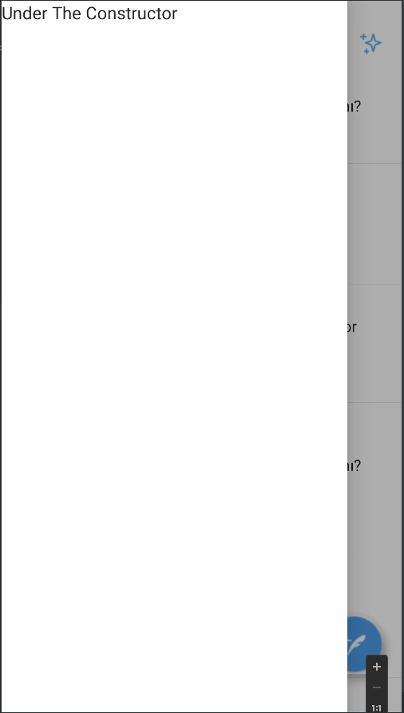

# Android Jetpack Twitter Clone

This is an Jetpack Android Application README to show How can we use jetpack components. You can 
find of design file on figma in https://www.figma.com/file/fMtS43pEZVD32mRAb26IeE/Twitter-UI-Screens-(Community)?node-id=4%3A2990

## Screens 
I have planned to completed to below screen but i have completed only home screen.In the next I will completed all of that screens
- Home Screen (Completed)
- Trends
- Notifications
- Left Menu
- Settings
- Messages
- 
## Used Component
- Column
- Row
- Scaffold,
- Image
- Icons

##Screenshots
You can find screenshots 
This is first screen that when the application has been opened

When click Profile image you can find left Menu

